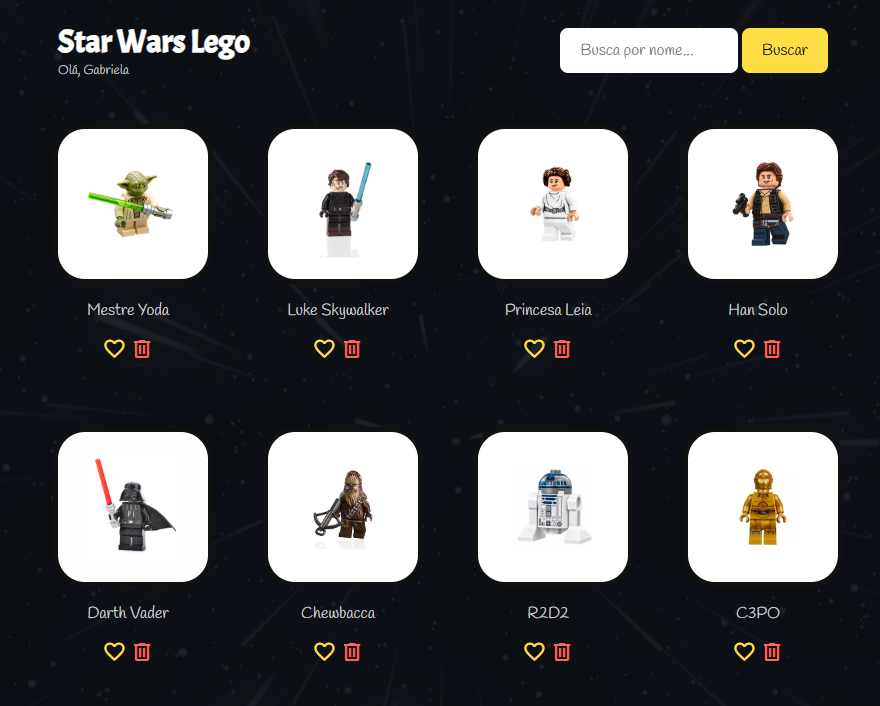

# Star Wars Vue Project

# Star Wars QA Web App (JavaScript)

## 🔗 Live Demo
https://gabidalla07.github.io/qa-js-vue-star-wars/

## About
This is a simple Star Wars web app built with JavaScript, HTML and CSS.

I used this project to practice DOM manipulation and, mainly, to apply a QA mindset on top of a front-end application.

## What the app does
- Search characters
- Mark/unmark as favorite
- Remove characters from the list

## QA Approach
Instead of focusing only on the UI, I looked at how the application behaves under different user actions.

Some points I considered:
- How search behaves with different inputs (empty, partial, invalid)
- UI state changes (favorite toggle, removal from list)
- Consistency between what is shown and the actual state of the application

## Test Scenarios (examples)
- Search for an existing character and validate results
- Search with empty input
- Toggle favorite multiple times and validate state
- Remove a character and ensure it no longer appears in the list

## Notes / Observations
- Favorite state is not persisted after page reload
- No feedback when search returns no results

## Tech
- JavaScript
- HTML
- CSS
- Vue.js (basic usage)

## Run locally
Just open `index.html` in your browser
